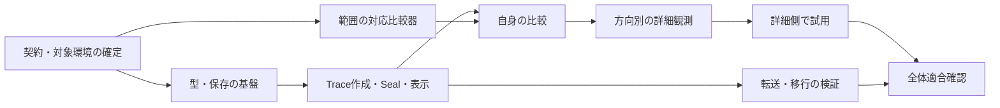

# Issue #17 範囲 Trace — 実装計画 P1

- 日付：2026-09-17
- 状態：実装計画案。コード着手・仕様承認・リリース完了の記録ではない。
- 対象：小さな Seal の範囲 Trace、自身・上流側・下流側の差異観測と詳細表示。
- 上位要件：Accepted Issue #17 R1、exact Seal `0f6adb86be04ac509f6affd117dc49013b6186e4da45e53a375a3f198990a80b`。
- 上位設計：[ADR 0032 D1](../adr/0032-content-origin-trace-and-directional-observation.md)、[承認記録](adr-0032-origin-trace-acceptance-2026-09-17.md)。
- 詳細契約：[ADR 0033](../adr/0033-origin-trace-storage-and-migration.md) / [0034](../adr/0034-origin-trace-correspondence.md) / [0035](../adr/0035-origin-trace-cli-and-observation-output.md)。いずれも Accepted（[2026-09-17 承認記録](adr-0033-0035-origin-trace-acceptance-2026-09-17.md)）。
- レビュー対象：日本語の本ファイル全体。

## 1. 到達点と現在地

利用者が、大きな原文を分割せずに複数の抜粋と独自表現から小さな Seal を作り、その過去の由来を検証できる状態を作る。
原文が変わったときは詳細側で、対応する範囲の一致・差異・判定不能、未調査部分、exact Seal グラフ上の自身・上流・下流を確認できるようにする。
whole-Seal Cause、既存 STALE、意味論を監査しない境界を保つ。

2026-09-17 に確認した基準はローカル main と remote main の `c23aa34cea273d7aa2beb94b9c9d69a924560fe6`。
現行 runtime は format 5/6、Issue #17 のコードは未実装。既存の [全体実装計画](implementation-plan.md) と `PLAN.pert` の format 6 完了を未完了へ戻さない。
別 worktree の Candidate explicit compare は別作業であり、今回の前提・完成済み機能として取り込まない。
作業中の要件、承認、設計文書、Seal を保持する。実装開始時には repository/remote の状態を再確認する。

現時点の機能利用価値は未実現。本計画は、設計から試用可能な機能までの依存関係と検証対象を明確にする成果である。
試用可能になるのは S6 後、機能全体の適合確認は S7/S8 後。日付・工数・課金額は未見積もりであり、ポイント数や納期を仮置きしない。

## 2. 着手条件と保留事項

| 条件 | 現在の状態 | 扱い |
|---|---|---|
| 要件 R1、論理設計 ADR 0032 | Accepted | 不変の上位入力。計画やテストで再解釈しない |
| 詳細契約 ADR 0033～0035 | Accepted | 2026-09-17 所有者が全文を採用。exact bytes は承認記録で固定。環境・性能条件は別途未決 |
| 行指向への比較変更 | 方針は所有者指示により確定、詳細改訂中 | [変更指示](issue-17-line-oriented-direction-2026-09-17.md)が旧byte指向規定に優先する。[詳細候補](issue-17-line-oriented-comparison-candidate-2026-09-17.md)により比較関連の具体化を更新する。旧 CONTRACT_REVIEW 完了は旧版採用の履歴であり、改訂詳細の採用を意味しない |
| 対象データ・プラットフォーム・資源条件 | 未設定 | 実装前に対象 workload と検証環境、処理予算の条件を定める。明示 budget と性能合格閾値は別 |
| `status` 表示追加 | 所有者が保留 | S6 の詳細側試用で必要性が見えたら戻る。恒久除外や追加必須にしない |
| 実装の実行 | 今回は計画作成の依頼 | 本計画をコード着手済みとは扱わない |
| 実 repository の移行・配布 | 未実施 | 仮設 repository の検証と分離し、実行先を特定した指示に従う |

format 7 と型の exact bytes、native snapshot transport 等の詳細契約は承認記録で固定済み。行指向への変更に関わる比較規則、比較予算と出力の差分は詳細改訂候補で扱う。
本計画の更新だけを、未承認の改訂詳細が採用された証拠にしない。
必要な実装順序は示すが、新しい schema 名・バージョン・性能値を計画から確定しない。

## 3. 実装の分割と依存関係

| ID | 作業と依存 | 完了時に確認できるもの | 主要な検証 |
|---|---|---|---|
| S0 | 上記条件の確定、採用版固定、AC と仕様の対応表作成 | 実装が従う exact 契約と対象環境 | R1/ADRとの矛盾、Proposed項目の残存を明示 |
| S1 | S0後：後継 domain/canonical、repository dispatch、typed closure | OriginMap/SourceSnapshot と後継 Seal/Candidate を検証できる | 正規 bytes/IDs、全被覆、空 content、overflow、境界外、コピー不一致、歴史 v5/v6 |
| S2 | S1後：一 REF の Trace authoring→Candidate→Seal→show と仮設 repository の明示移行 | 原文を分割せず小さな Seal を作り、由来を読み戻せる | 複数原文＋Untraced、中間 Seal、exact origin 引継ぎ、content変更guard、CAS失敗、旧ID保持 |
| S3 | 改訂詳細確定とS0後にS1と並行可：ファイル/REFに依存しない行指向比較器 | 行単位の対応を保存済みbyte範囲へ結び付け、一致・差異・判定不能を説明できる | 行の全最適対応、行途中の抜粋、範囲外の競合、置換/削除、反復行、境界、宣言、改訂budget終了 |
| S4 | S2＋S3後：local source binding/対応宣言、安定観測、自身の trace compare | 現在の原文との比較を CLI で確認できる | Candidate優先とHEAD識別、missing/unreadable、NO_TRACE/対象なし/未調査、二版固定の宣言 |
| S5 | S4後：exact Cause方向の集計とhuman/JSON詳細出力 | 自身・上流・下流、直接/間接、理由・経路を独立に確認できる | 鎖/diamond、両方向の差異と判定不能、direct＋indirect、旧target、新HEAD、観測中変更 |
| S6 | S5後：仮設環境で詳細側を通して試用 | 作成→原文変更→影響の発見→詳細確認の使い勝手を評価できる | AC1～AC11の操作、結果の解釈、調査対象の発見、status保留の再検討材料 |
| S7 | S2後にS3～S6と並行可：native snapshot dump/loadと移行異常系の仕上げ | 新規仮設repositoryへ由来を欠落なく運べる | typed closure/opaque orphan/旧ID、対象外local設定、不正入力、atomic公開、公開後出力失敗 |
| S8 | S6＋S7後：規範文書/help/completionの最終整合、全体検証、独立レビュー | 採用した全契約の適合証拠と残課題の明細 | 下記の全体検証、AC対応、受容していない差分、再現手順 |



S2 は利用可能な最初の作成・履歴検証の単位だが、現在比較や方向別観測の完成ではない。
S6 は先行試用であり、S7 を省略して機能全体が完了したとはしない。
文書・help・focused tests は各 slice とともに更新し、S8 で初めて全て書く進め方にはしない。

### 現行コードへの接続箇所

以下は current main の読取調査に基づく着手点であり、新しい公開仕様の根拠ではない。

| 段階 | 既存箇所と再利用する境界 |
|---|---|
| S1 | `internal/domain/v5`, `v6` と `internal/canonical/v5`, `v6` の model/codec を参照し後継型を追加。`internal/store` の Blob 意味は維持 |
| S2 | `internal/repository/candidate.go` の LoadSnapshot/SaveIfUnchanged、`candidate_lifecycle.go` の prospectiveSeal、`repository.go` の Add/Seal/LoadSeal。これらは一担当が統合 |
| S1/S2/S7 | `internal/repository/fsck.go` の typed inventory/reference/closure と `migrate_format6.go` の config-only transaction。format4 extractor の意味を後継移行に流用しない |
| S3 | 新しい独立比較 module。`internal/repository/source.go` の既存全文比較を範囲比較器に変質させない |
| S4 | `internal/workfile/workfile.go` の ReadStable と local REF binding のCASパターン。Traceのsource_key bindingは別のrecordとして実装 |
| S5 | `internal/repository/observation_v5.go` の observedGraph.nodes/causes/revisions と `observation.go` の再照合。Cause adjacency と逆向きindexを使用 |
| S4/S5/S8 | `internal/cli/run.go`、`inspection_json.go`/`inspection_json_v3.go`、`human_output.go`、`help.go`、`completion.go` |
| 回帰 | `repository_v5_test.go`、`format6_test.go`、`fsck_v5_test.go`、`revision_graph_v5_test.go`、`source_test.go`、`internal/cli/run_test.go` の保護対象を維持 |

既存 graph 実装は repository 層にある。論理設計の graph 責務を理由に、無関係な package 分割や大規模 refactor を先行必須にしない。

## 4. 各段階の実装・検証方針

### S1 / S2：由来を失わず固定する

- 物理 Blob store は変えず、typed schema/codec と検証を追加する。歴史形式の reader と後継 writer を明示的に分ける。
- source 全文を一度の安定観測から固定し、content/map を一 Candidate 更新として処理する。
- seal 公開で Candidate.origin と Provenance.origin、Candidate.content と Material.content の一致を保つ。
- invalid Trace を current source difference に変換しない。ローカルファイルを使って過去の Trace を検証し直さない。
- 移行検証は仮設 format5/6 repository で行い、既存 object/REF/tag/Candidate の exact bytes が保持されることを読み戻す。現在の project `.sealgraph` を移行しない。

### S3 / S4：確定できる範囲とできない範囲を分ける

- 小さな二版の例では、独立した全最適経路列挙を参照として、実装する合意判定と比較する。実装自体の結果を期待値にしない。
- `abcXdef → abcYdef` の X 範囲は置換、`abcXdef → abcdef` は削除、`aa → a` の対応は曖昧という契約を検証する。
- 位置だけの変化、対象外部分だけの曖昧性、別位置の同文による削除抑制を分ける。
- declaration は exact snapshot/current BlobID に固定し、同じ対応の複数根拠と矛盾する対応を区別する。
- budget終了は未調査、I/O失敗や対応競合は判定不能、履歴構造不正はエラーとする。
- 完全性は「調査を終えた範囲」を表す。差異がない、真である、意味が同じ、という結論にはしない。

### S5：グラフの観測を混ぜない

- 比較器が返す各 exact Seal 自身の local facts を共有し、上流結果を逆方向に再伝播させない。
- revision assertion は集合の取得に使用しても、Cause の依存経路に混ぜない。
- 新 HEAD や Candidate で Cause target を置き換えない。Candidate 自身と HEAD 中心の graph は別出力にする。
- 同じ対象に直接・間接の経路が両方あれば両方を示す。表示経路の本数と対象集合・件数を混同しない。
- 元ファイルだけ変えた前後で既存 STALE の結果が同じことを、同じ固定 graph で検証する。

### S6：詳細側で試し、status に戻る必要性を判断する

試用入力は保存してよいことが明確な仮設文書を使う。実運用文書を無条件に全文取り込まない。
まず大きな原文二つと独自表現で小さな Seal を作り、中間 Seal に依存する Seal を追加する。
次に前方挿入、対象範囲の変更・削除、重複による曖昧性、読み取り不能を個別に起こし、詳細表示から影響を追う。
AC6 の鎖を用い、自身・上流側・下流側をそれぞれ実際に表示した結果も試用記録に含める。S5 の検証結果だけで実試用を済ませたとは扱わない。

記録するのは、利用した入力/版/予算、結果と理由、調査範囲、必要だった操作、および利用者が対象を見つけられたかという観測である。
特に次を再検討材料にするが、新しい数値的合格条件にはしない。

- 通常の作業から詳細確認へ到達しにくい場面があるか。
- 自身・上流・下流の異常を探すために一覧表示が必要になるか。
- 未調査や判定不能を、差異なしと読み違えやすい表示があるか。
- 元ファイルを読む費用がどの入力・環境で生じたか。

必要性が見えた場合は、試用の証拠と status へ表示する具体的な範囲・副作用を所有者へ戻す。
必要性が未判定なら保留を維持する。試用しただけで status を自動拡張せず、逆に恒久的に除外もしない。

### S7 / S8：保持と配布可能性を確認する

native snapshot の全 Blob（無参照分を含む）という対象範囲を検証し、local binding/対応宣言が混入しないことを確認する。
load は absent destination のみに公開し、失敗時の staging と公開後の配達失敗を区別する。旧 format4 用 transport はそのままの意味で検証する。
後継 machine schema、human escaping、help、completion、例、移行案内を同じ採用仕様へ揃える。
S8 で得られるのは実装の適合証拠であり、公開・実データ移行・所有者による最終受入を自動的に成立させない。

## 5. 要件と受け入れ確認の対応

| AC | 主たる確認段階 | 検証内容 |
|---|---|---|
| AC1/AC2 | S2 | 大きな原文を分割しない抜粋、二原文＋独自表現、copy一致 |
| AC3 | S2/S5 | 中間 Seal の Trace とその whole-Seal Cause |
| AC4/AC5 | S3/S4 | 位置変化、置換、削除、判定不能、宣言の根拠 |
| AC6/AC7 | S5 | 自身・上流・下流、直接/間接、差異と判定不能の併存 |
| AC8/AC9 | S4/S5 | Candidate/HEAD/exact target、下流の観測範囲と不完全性 |
| AC10 | S5 | fileだけの変更でSTALEを変えない |
| AC11 | S1/S2/S5 | 構造不正は検出、意味の矛盾や無意味なCauseは拒否しない |

S7 の exact bytes/closure 保存は ADR 0032 §3.3/§10 と、採用される ADR 0033/0035 に対応する。
これらを AC1～AC11 の代わりの完成基準にはしない。

## 6. 検証の実行範囲

各 slice では新しく変わる契約に対する focused tests を実行し、次の統合点まで不要な全件再実行を繰り返さない。
後継型・公開・CLI が統合された時点と最終の code completion では、repository AGENTS の必須検証を行う。

```sh
gofmt -w .
go vet ./...
go test ./...
npm ci
npm run clone-check
make complexity-check
make deadcode-check
```

CLI変更に対応して completion 回帰も行う。CAS/観測の同時実行部分には、再現可能な競合ケースを置く。
必要な race 検証は変更した競合経路を対象にする。今回 Git integration の意味は変更しない。
実装時の test assertions は Accepted 要件/採用設計の該当節へ対応付け、テストの都合で上位仕様を変更しない。

## 7. 担当・見積もり・残る判断

S1/S2 の保存・公開担当、S3 の純粋比較器担当は、契約確定後に独立して進められる。
repository/cli の共有ファイルは一度に一担当とし、S4/S5 統合時に変更を重ねない。
通常の独立レビューは一名を起点とし、形式・データ保持の未解決リスクがあれば、その具体的なリスクに限定して追加確認する。

工数・納期は、S0 の対象規模/プラットフォームと実装分割の確定後に見積もる。
比較の最適経路処理、全 source 保持量、混在形式の読み取り、出力の調整が費用の不確実性である。
`PLAN.pert` へ未根拠の duration/velocity を追加せず、日程を決める段階でこの依存関係を投影する。

次の実装開始点は S0 の確定後の S1 と S3。
`status` の再検討は S6、実 repository 移行と配布は対象を定めた別の実行判断である。

## perttool への具体化（2026-09-17）

所有者の依頼により[専用PERT計画](issue-17-origin-trace.pert)を作成し、提示した候補への保存承認を受けて記録した。
12作業の未計測三点ポイント見積もり、担当1枠の仮定、依存関係と未決前提を含む。工数・納期が未確定という本文の限界は維持し、相対ポイントを日数や実測値と扱わない。
[候補・解析・保存記録](issue-17-origin-trace-pert-preview-2026-09-17.md)を参照。既存PLAN.pertと実装の開始状態は変更していない。
